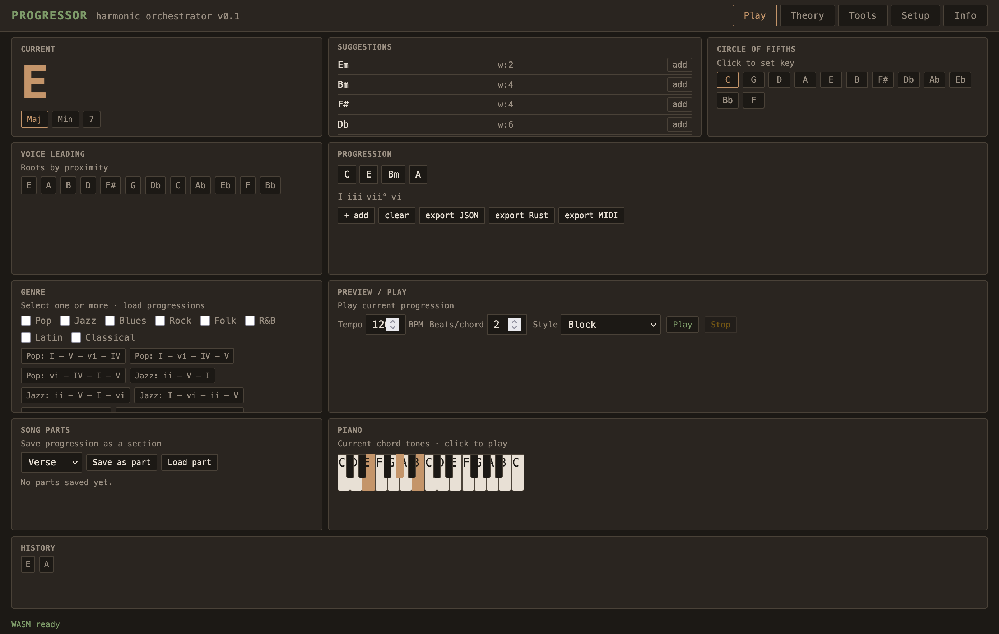

# PROGRESSOR

### *The Harmonic Orchestrator for Professional Improvisation*

**PROGRESSOR** is a high-performance, web-based harmonic engine designed for musicians who treat improvisation as a science. Built with a **retro-terminal aesthetic**, it provides a distraction-free interface for guitarists and pianists to bridge the gap between music theory and muscle memory.

Unlike standard chord shufflers, **PROGRESSOR** uses a weighted **graph** (Circle of Fifths, modal interchange) to suggest smooth chord transitions and voice-leading in real time.



---

## Key Features

* **Harmonic engine:** Circle-of-fifths–based suggestions, diatonic and modal-interchange chords, secondary dominants.
* **Voice leading:** Roots ordered by proximity; chord-flow diagram on the Theory tab.
* **Song parts:** Save and load progressions as Verse, Chorus, Bridge, Intro, Outro.
* **Genre & progressions:** Multi-select genres (Pop, Jazz, Blues, Rock, Folk, R&B, Latin, Classical) and load genre-specific progressions in the current key.
* **Preview / Play:** Play the current progression with adjustable tempo (BPM), beats per chord, and style (block or arpeggio up/down).
* **Piano:** On-screen keyboard with current-chord highlighting and click-to-play notes.
* **MIDI:** Web MIDI API status and **export progression as .mid file**.
* **Export:** JSON, Rust struct, or MIDI for use in DAWs or code.
* **Themes:** Multiple themes (Terminal, Oscilloscope, Parchment, Neon, Ember, Stealth, Ocean, Forest, Sunset, Ink, Lime, Rose, Polar).
* **Keyboard shortcuts:** Documented in Info and Setup (e.g. 1–8 suggestions, Enter add, C clear, F1–F5 tabs).

---

## Technical Architecture

* **Logic:** **Rust + WASM** core (wasm-pack, web target) for harmonic calculations.
* **UI:** Custom CSS, no Tailwind; single-screen Play layout with tabs (Play, Theory, Tools, Setup, Info).
* **Environment:** macOS-friendly; `./px` script for build and serve.

---

## Getting Started

```bash
# Clone the repository
git clone https://github.com/makalin/progressor.git
cd progressor

# Build the WASM core (outputs pkg/)
./px build
# Or: wasm-pack build --target web

# Serve and open in browser
./px serve
```

Then open **http://127.0.0.1:8080** in your browser.

---

## Credits & Author

**PROGRESSOR** is designed and maintained by **Mehmet T. AKALIN**.

* **Website:** [dv.com.tr](https://dv.com.tr)
* **GitHub:** [github.com/makalin](https://github.com/makalin)
* **LinkedIn:** [linkedin.com/in/makalin/](https://www.linkedin.com/in/makalin/)
* **X (Twitter):** [@makalin](https://x.com/makalin)
* **CV:** [dv.com.tr/makalin/](https://dv.com.tr/makalin/)

**License:** MIT
